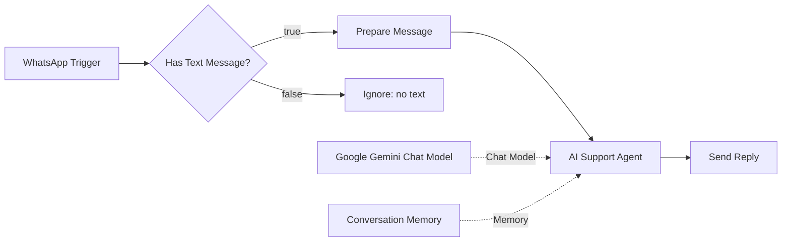

# WhatsApp AI Support Agent

An AI-powered customer support and lead-response bot built in **n8n**, using **Google Gemini** for conversational intelligence and persistent memory for context-aware, multi-turn conversations over WhatsApp.

## Overview

Businesses lose leads and frustrate customers when WhatsApp messages sit unanswered outside business hours. This workflow gives any business an always-on first responder: it listens for incoming WhatsApp messages, filters out anything that isn't plain text (images, voice notes, stickers, etc.), hands qualifying messages to an AI agent with short-term conversational memory, and sends a reply back automatically — no developer required after initial setup.

## How it works

1. **WhatsApp Trigger** — listens for new incoming WhatsApp messages in real time.
2. **Has Text Message?** — routes the message based on type.
   - **True** → passed along to be answered.
   - **False** → routed to **Ignore (no text)**, so media/unsupported message types don't break the agent or trigger a nonsensical reply.
3. **Prepare Message** — normalizes the incoming payload (sender info, message text, etc.) into the shape the AI agent expects.
4. **AI Support Agent** — an n8n AI Agent node that:
   - Uses **Google Gemini** as its chat model for generating responses.
   - Uses **Conversation Memory** to remember prior turns per user/session, so context isn't lost between messages.
   - Has an open **Tool** slot, designed so the agent can be extended with real actions (see "Extending this project").
5. **Send Reply** — sends the AI-generated response back to the customer over WhatsApp.

## Tech stack

- n8n (workflow orchestration)
- WhatsApp Business Cloud API (trigger + send)
- Google Gemini (LLM / chat model)
- n8n Conversation Memory (per-session buffer memory)

## Architecture

## Use cases

- 24/7 first-response support for common questions (hours, pricing, availability, FAQs)
- Lead capture and qualification before a human takes over
- Reducing response time on WhatsApp so leads don't go cold
- A foundation for a full support/sales assistant once tools are attached

## Extending this project

The **Tool** input on the AI Agent is intentionally left open so the bot can be connected to real business systems, for example:

- Order/appointment lookup (CRM, Google Calendar, database)
- Escalation to a human agent for complex queries
- Product catalog / pricing lookup
- Ticket creation in a helpdesk tool

## Setup

1. Import `workflow.json` into your n8n instance.
2. Connect a WhatsApp Business Cloud API credential to the **WhatsApp Trigger** and **Send Reply** nodes.
3. Connect a Google Gemini API credential to the **Google Gemini Chat Model** node.
4. Activate the workflow.

## License

MIT
